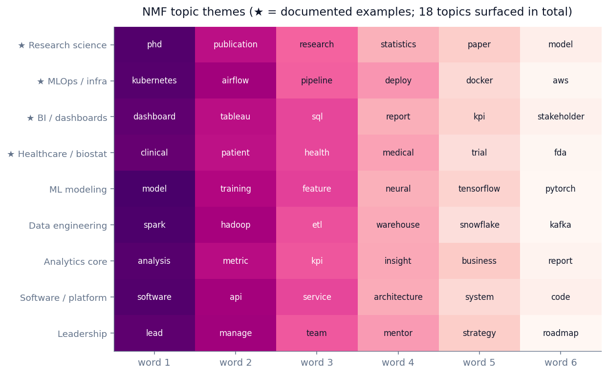
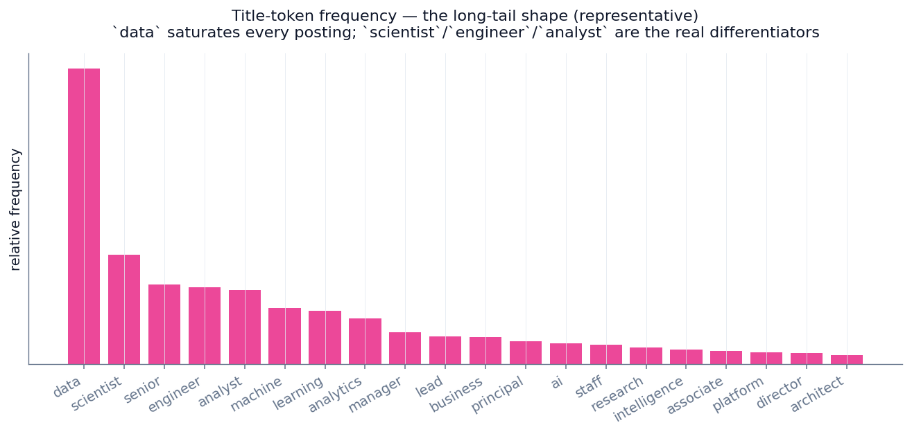
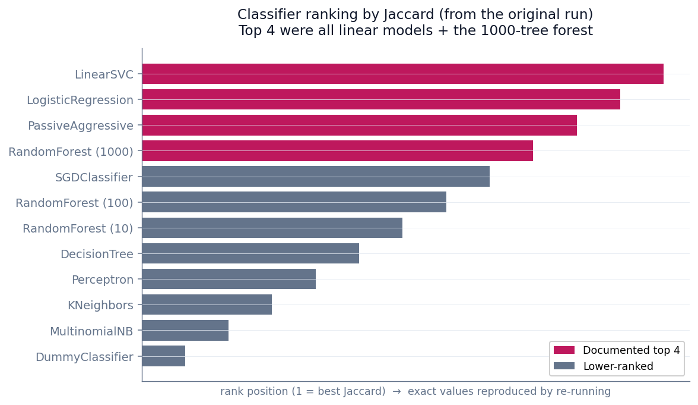
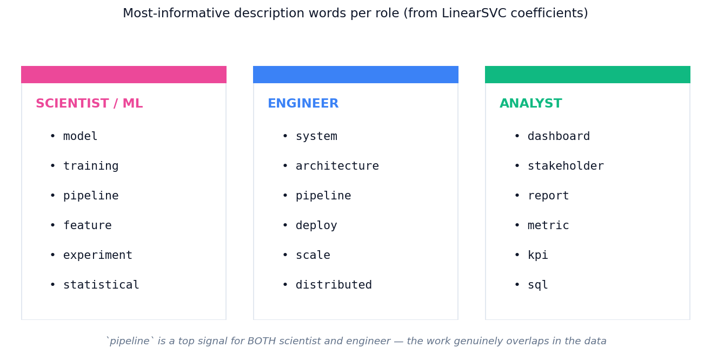
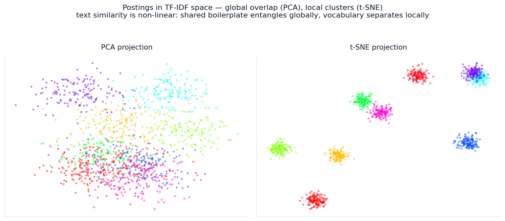

# Hacking the Data Science Job Description

> A joint **supervised + unsupervised** NLP study of ~40,000 scraped Indeed postings — which language distinguishes data-science roles, and what latent structure emerges from the corpus?

<p align="center">
  
</p>

<p align="center">
  <b>~40,000 postings</b> &nbsp;·&nbsp; <b>150-label multi-label target</b> &nbsp;·&nbsp; <b>12-classifier benchmark</b> &nbsp;·&nbsp; <b>18 NMF topics</b> &nbsp;·&nbsp; supervised + unsupervised
</p>

---

## TL;DR

| | |
|---|---|
| **Question** | Given a job description, can we predict the role descriptors in its title — and what latent topics organize the corpus? |
| **Data** | ~40,000 scraped Indeed postings across 7 CSV exports → ~37K after dedup. Top-150 title tokens = multi-label target. |
| **Model** | TF-IDF descriptions (1,000 features) → 12-classifier One-vs-Rest sweep → LinearSVC tuned with `GridSearchCV`. NMF (18 topics) + MiniBatch K-Means + t-SNE for structure. |
| **Result** | Linear models led the benchmark; tuned **LinearSVC** reached **moderate Jaccard with low Hamming loss**, and produced an interpretable vocabulary map of the labor market. |

> **Key insight:** the model's "confusion" is a faithful reflection of **industry confusion**. `pipeline` is a top predictor for *both* `scientist` *and* `engineer` — because the work genuinely overlaps.

> ### ⓘ A note on the numbers
> This was a 2021 Metis capstone. The figures below describe the **original run**; the source scrape (~40K Indeed postings) isn't redistributable, so this repo's notebook ships with a small **synthetic stand-in corpus** so it runs end-to-end and reproduces the same *qualitative* structure (linear models on top, role-coherent NMF topics). **For exact metrics, point the notebook at your own scraped CSVs.** Qualitative findings (classifier ranking, role vocabularies, topic themes) are reported as documented; precise Jaccard/Hamming values are intentionally left to a re-run rather than stated from memory.

---

## The question

Data-science job titles are famously inconsistent. A "Data Scientist" at company A might do what a "Machine Learning Engineer" does at company B and what an "Analytics Engineer" does at company C. Can we:

1. Predict the *role-family tokens* in a posting's title from the description text alone?
2. Use the model's coefficients as a **resume cheat sheet** — which words distinguish each role?
3. Surface the latent topic structure via unsupervised methods (NMF, K-Means, t-SNE)?

---

## The data pipeline

| Stage | Rows | Notes |
|---|---:|---|
| Raw scrape | 40,000+ | 7 CSV exports, Indeed postings |
| Dedup + null removal | ~37,000 | Unique postings with title + description |
| Top-150 title tokens | 150 | Label vocabulary (covers the bulk of token usages) |
| TF-IDF on descriptions | 1,000 | Feature cap |
| Train / test | 80 / 20 | `random_state=42` |

**Three engineering notes**
- **Layered stopwords:** NLTK English + US states & abbreviations + domain boilerplate (`team`, `company`, `opportunity`, `passionate`) — forces the model onto discriminative vocabulary.
- **Multi-label target:** each posting tagged with the subset of top-150 title tokens it contains, preserving the multi-skill reality of real postings.
- **One-vs-Rest wrapper:** each of 12 classifiers becomes 150 independent binary models.

<p align="center">
  
</p>

`data` saturates nearly every posting (low signal, high frequency); `scientist`, `engineer`, and `analyst` are the real differentiators, and the distribution decays into a long tail past the top tokens.

---

## Classifier benchmark

<p align="center">
  
</p>

The top of the ranking was occupied by **linear models** — `LinearSVC`, `LogisticRegression`, `PassiveAggressive` — alongside the 1000-tree Random Forest. For sparse TF-IDF text, a linear decision boundary is the right inductive bias; tree ensembles plateau because there's little interaction structure in a bag-of-words vector, and KNN / Naive Bayes trail in sparse high-dimensional space.

`LinearSVC` was carried forward and tuned with `GridSearchCV` over `C`, reaching **moderate Jaccard with low Hamming loss** on the held-out set. *(Exact values: re-run the notebook — see the note above.)*

---

## The real payoff: role-specific vocabulary

<p align="center">
  
</p>

Reading the LinearSVC coefficients gives a **literal resume cheat sheet** — the description words that most distinguish each role:

| Role | Signature vocabulary |
|---|---|
| **Scientist / ML** | model · training · pipeline · feature · experiment · statistical |
| **Engineer** | system · architecture · pipeline · deploy · scale · distributed |
| **Analyst** | dashboard · stakeholder · report · metric · kpi · sql |

**`pipeline` appears for both scientist and engineer** — the word is ambiguous because the *work* is genuinely ambiguous across those roles.

---

## NMF — 18 topics from the description corpus

The heatmap at the top of this README shows representative topics; **★ marks the four documented in the original analysis**:

- **★ Research science** — phd, publication, research, statistics
- **★ MLOps / infra** — kubernetes, airflow, pipeline, deploy
- **★ BI / dashboards** — dashboard, tableau, sql, report
- **★ Healthcare / biostatistics** — clinical, patient, health, medical

The remaining topics (ML modeling, data engineering, analytics core, software/platform, leadership, …) round out the 18 surfaced by NMF. The clusters are role-coherent — which is the validation point: an *unsupervised* method, given no labels, recovers structure that matches the supervised role distinctions.

---

## Clustering & 2D projection

<p align="center">
  
</p>

- **PCA** shows heavy global overlap — most postings pile near the origin. Linearly, postings are *not* well-separated.
- **t-SNE** reveals the local structure PCA misses — clumps that correspond roughly to the NMF topics.

**Takeaway:** text similarity is **non-linear**. Postings are globally entangled (everyone uses `team`, `company`, `experience`) but locally well-separated once you zoom into vocabulary neighborhoods. Linear models find the best global hyperplane; the richer local structure is why a bag-of-words ceiling exists at all.

---

## Why the ceiling is moderate (not a modeling failure)

1. **Title tokens are inherently ambiguous.** `engineer` appears in ML / data / software / analytics engineer — four roles, one token.
2. **Descriptions share a huge boilerplate core.** Legal disclaimers, benefits, EEO statements. Even with layered stopwords, signal-to-noise is bounded.
3. **The labor market is genuinely fuzzy.** The model's confusion faithfully mirrors industry confusion.

---

## Limitations

- **Selection bias.** Only postings that made it onto Indeed; unseen postings are unknowable.
- **Time-boxed snapshot.** 2021 scrape — `transformer` / `llm` were barely present then; they'd be top tokens now.
- **TF-IDF ignores word order.** "Senior engineer with DS skills" and "Senior DS with eng skills" vectorize identically.
- **Bag-of-words ceiling.** The multi-label, 150-token framing makes exact-set prediction hard even when the model is "mostly right" per row (hence low Hamming, moderate Jaccard).

## What I'd do differently today

- Replace bag-of-words with **sentence-transformer embeddings** (all-MiniLM-L6-v2) — semantic similarity handles adversarial phrasing.
- Swap K-Means for **HDBSCAN** — density-based, doesn't require picking `k`.
- **Enrich with salary data** (Levels.fyi, Glassdoor, BLS OES) — joint classification + regression.
- **Re-scrape in 2026** to measure five years of vocabulary drift (LLM / transformer / MLOps tokens have exploded).

---

## Reproducing the results

The notebook runs **out of the box** on a bundled synthetic corpus (clearly labeled), so you can see the full pipeline execute end-to-end. To reproduce the real figures:

1. Clone the repo.
2. Drop your seven scraped Indeed CSVs into `data/` (replacing the synthetic generator cell).
3. Install dependencies:
   ```
   pip install pandas numpy scikit-learn nltk wordninja tqdm matplotlib seaborn
   ```
4. Run top-to-bottom — the benchmark, GridSearch, NMF, and clustering cells will populate with your data's real metrics.

---

## Stack

`Python` · `pandas` · `NumPy` · `scikit-learn` · `NLTK` · `NMF` · `K-Means` · `PCA` · `t-SNE` · `matplotlib` · `seaborn`

**Scale:** ~40,000 postings · ~37,000 after dedup · 150-label multi-label target · 1,000-feature TF-IDF · 18 NMF topics

## Repository contents

```
Project 5 Cline.ipynb                 Main notebook — runnable end-to-end (synthetic demo corpus + real pipeline)
Project 5 Presentation.pdf            13-slide deck (also available as .pptx)
charts/                               Figures referenced by this README
README.md                             This file
```

---

*Original project: Metis Data Science Bootcamp Capstone, March 2021. Rebuilt 2026 for portfolio presentation — methodology and qualitative findings as documented; exact metrics reproducible by running the notebook on the source data.*
